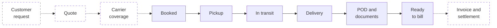
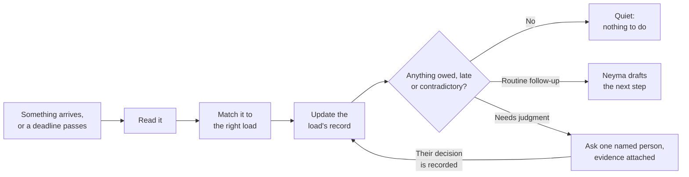
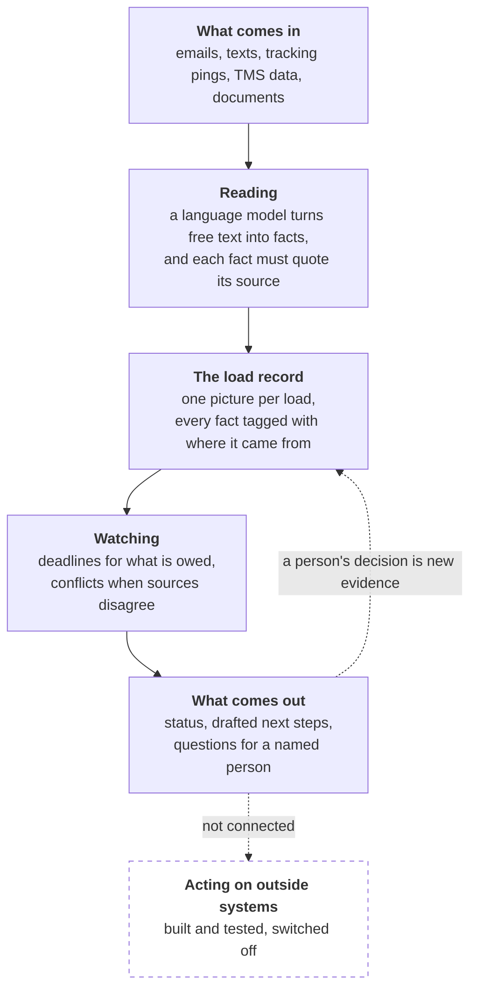

<h1 align="center">Neyma — AI That Operates Freight</h1>

<p align="center"><strong>More loads. Same team.</strong></p>

<p align="center">
Neyma is an AI operational teammate for freight brokerages. It works across the tools a brokerage<br>
already uses, keeps one clear picture of every load, catches what is late, missing or contradictory,<br>
and brings each real decision to the right person with the evidence attached.
</p>

<p align="center">
<a href="#what-it-does">What it does</a> ·
<a href="#neyma-at-work">Examples</a> ·
<a href="#how-neyma-operates-a-load">How it works</a> ·
<a href="#see-it-catch-a-problem">Demo</a> ·
<a href="#quick-start">Quick start</a> ·
<a href="#current-status">Status</a>
</p>

> **Working prototype.** Everything shown below runs today on synthetic freight data in shadow
> mode: Neyma drafts its next step and sends nothing. It has no customers and no production
> deployment. Planned capabilities are labelled as planned.

---

## The idea

A freight brokerage runs on email threads, driver texts, tracking pings, TMS screens, PDFs and
phone calls. They routinely disagree with each other, and most of what goes wrong is a *silence*:
the proof of delivery that never arrived, the check call nobody made, the appointment that moved
while the truck kept driving to the old one.

Today a person holds all of that in their head, for every load, all day. That is what caps how
many loads a team can move.

Neyma is meant to carry it instead: **one intelligent system that follows a load from the
customer's first request through billing**, across the tools the brokerage already has, so the
team spends its time on decisions rather than on chasing and re-checking.

## What it does

For every load, at every moment, Neyma can answer six questions:

| | |
|---|---|
| **What is happening?** | The load's current stage, and the evidence behind it |
| **What is still owed?** | Every open item: an arrival, a status update, a document |
| **What is overdue?** | Deadlines that passed with nothing arriving |
| **What would Neyma do next?** | The follow-up it would send, written out as a draft |
| **What needs a person, and why?** | One named owner, one question, the evidence attached |
| **Is this load ready to bill?** | Yes or no, with the exact reason when it is no |

Across the life of a load, that covers:

| Capability | In the prototype today | |
|---|---|---|
| **Understanding freight messages** | Reads emails, texts and documents into structured facts, each tied to the words it came from | Working |
| **Tracking active loads** | Follows each load from booked to delivered across tracking, TMS and carrier updates | Working |
| **Detecting delays and appointment problems** | Notices missed check-ins, late arrivals and appointments that moved | Working |
| **Handling conflicting updates** | When two sources disagree, flags the conflict instead of picking a winner | Working |
| **Managing missing documents and PODs** | Knows which paperwork is owed, when it is late, and drafts the request | Working |
| **Identifying billing discrepancies** | Compares the carrier invoice to the rate confirmation and flags mismatches | Working |
| **Escalating to humans** | Routes each open decision to one accountable person with the evidence | Working |
| **Quoting** | Turning a customer request into a priced quote | Planned |
| **Carrier coverage** | Finding and booking a carrier for a load | Planned |
| **Acting on its own** | Sending the messages it drafts and updating outside systems | Planned |

"Working" means it runs end to end on synthetic loads in this repository. It does not mean it has
been used by a brokerage.

## Neyma at work

Every block of output below comes from the prototype running on the synthetic loads that ship in
this repository, trimmed for width (timestamps shortened, internal evidence ids removed).

### 1. It reads freight the way people write it

A driver texts:

> *"Checked in at the shipper 9:40, door 12. Should be loaded within the hour."*

Neyma records one fact, **at pickup**, tied to that sentence and marked as read from a message
rather than confirmed by a system. If the supporting words are not literally in the message, the
fact is dropped. It never guesses which load a message belongs to: no exact reference match means
a person is asked.

### 2. An appointment moves, and two sources disagree

The system of record says the receiver's window is 9:00–11:00. The carrier reports that the
receiver pushed it to 14:00. Neyma does not choose. It asks the load's owner, with both versions attached:

```text
 8 needs a human EVIDENCE_CONFLICT -> dana.ortiz
 9 why           EVIDENCE_CONFLICT: Sources state different appointment windows for one stop.
                 asks dana.ortiz: Which statement is right?
                 evidence: SYSTEM_IMPORTED says 2026-08-17T09:00..11:00 America/Kentucky/Louisville
                 evidence: MODEL_EXTRACTED says 2026-08-17T14:00..14:00 America/Kentucky/Louisville
```

Dana confirms the new time. The arrival deadline Neyma is watching moves five hours later with
it, so the truck is not flagged late against an appointment that no longer exists.

### 3. The POD never comes

The load delivers. A day later the proof of delivery still has not arrived. Nothing happened, and
that is exactly the event Neyma is built to notice:

```text
--- 2026-08-17T13:56  (a deadline passed; nothing arrived)
 1 happening     Delivery has been reported. Carrier: Ironwood Hauling Inc. POD: OUTSTANDING.
 5 overdue       DOCUMENT_REQUIRED (due 2026-08-17T13:55, OVERDUE)
 7 Neyma would   REQUEST_POD -> carrier (Ironwood Hauling Inc)
                 DRAFT, NOT SENT: Load LD-50014 is reported delivered at Bluff City Lumber. Please
                 send the signed proof of delivery, all pages, so the load can be closed out.
10 billing ready no - document requirement POD is OUTSTANDING
```

### 4. The carrier bills more than was agreed

The invoice arrives and its linehaul does not match the signed rate confirmation. Neyma flags it
and stops there. It never picks an amount:

```text
 8 needs a human INVOICE_DISCREPANCY -> dana.ortiz
 9 why           Carrier invoice INV-50017 does not match what was agreed: billed linehaul
                 differs from the rate confirmation.
                 asks dana.ortiz: Which figure is owed? Nothing is adjusted until a human says.
```

<p align="center">

</p>

<p align="center"><sub>
Review page from Neyma's first surface, invoice reconciliation, on synthetic data: the
discrepancy, the documents and the decision in one place. The current engine reports through the
command line.
</sub></p>

## How Neyma operates a load

Solid stages run in the prototype. Dashed stages are the intended product and are not built.



At every stage it runs the same loop, each time something arrives *or a deadline passes in
silence*:



A load is **quiet** only when nothing is owed, nothing is overdue and nothing is waiting on a
person. Quiet is the goal: it means the team can stop thinking about that load.

## See it catch a problem

**A delivery the driver reported and the truck had not made.**

A driver texts *"delivered, empty"* before the receiver's window has even opened. Five minutes
later the tracking provider shows the truck still on the interstate.

```bash
.venv/bin/python docs/portfolio/demo/disputed_delivery.py
```

```text
  TIME        WHAT ARRIVED            STAGE      POSTURE         BILL     NEXT
  09-02T12:30 driver-says-delivered   DELIVERED  NEYMA_CAN_ACT   bill=no  NEYMA:REQUEST_POD
  09-02T12:35 provider-says-moving    DISPUTED   HUMAN_ATTENTION bill=no  HUMAN:EVIDENCE_CONFLICT
  09-02T13:00 dana-says-moving        IN_TRANSIT WAIT            bill=no  WAIT
 ~09-02T15:01 deadline@15:01          IN_TRANSIT NEYMA_CAN_ACT   bill=no  NEYMA:REQUEST_CARRIER_STATUS
  09-02T18:30 at-delivery             IN_TRANSIT QUIET           bill=no  NOTHING
  09-02T19:00 delivered               DELIVERED  NEYMA_CAN_ACT   bill=no  NEYMA:REQUEST_POD
  09-02T19:30 pod                     DELIVERED  QUIET           bill=yes NOTHING
```

<sub>Actual output with a header row added, columns condensed and trailing detail trimmed; `~`
marks a deadline that passed in silence. Unedited capture:
[`expected_output.txt`](docs/portfolio/demo/expected_output.txt).</sub>

What happened, in plain terms:

| Time | What Neyma did |
|---|---|
| **12:30** | Took the driver at his word, for now, and prepared to ask for the POD. |
| **12:35** | Saw tracking contradict him. Marked the load **disputed** and asked Dana, with both pieces of evidence. It did not pick a side. |
| **13:00** | Dana called the receiver: still in transit. Neyma withdrew the early POD request and **started watching the delivery appointment again**. |
| **15:01** | The delivery window closed with no arrival. Neyma drafted a status request to the carrier. |
| **19:30** | Delivered for real, POD on file. The load goes quiet and is ready to bill, after one human touch. |

The 13:00 step is the hard one. The driver's false "delivered" had already satisfied the delivery
watch, so overruling him has to make that delivery *owed again*. Otherwise the load reads "nothing
to do" while a truck misses its appointment. An earlier version of Neyma had exactly that bug;
finding and fixing it is the subject of the [case study](docs/portfolio/CASE_STUDY.md).

Nothing in the record was rewritten along the way. The driver's claim is still on file, marked as
overruled by Dana. Full walkthrough: [`docs/portfolio/DEMO.md`](docs/portfolio/DEMO.md).

## Core capabilities

**One record per load.** Every email, text, ping, TMS row and document about a load lands in a
single picture, so nobody reconciles five tabs by hand.

**Every fact knows its source.** Neyma remembers who said what, and how much that source can be
trusted. Something a model read from an email is never treated like something a person confirmed.

**Silence is a signal.** Neyma holds a deadline for everything that is owed, so "nothing
happened" is something it can see. It also tells apart "we were watching and it never came" from
"we could not see at the time".

**Disagreements go to people.** When sources conflict, Neyma does not settle it by recency,
confidence or a model's opinion. A named person decides, and that decision is recorded.

**One owner per decision.** Every open question has exactly one accountable human, with the
evidence already assembled. No shared inbox where everyone assumes someone else has it.

**Draft first, act later.** In the prototype every outbound message is a draft that nobody sends.
The controls for acting safely are built and tested, and deliberately switched off.

**Each brokerage is sealed off.** Two brokerages can have the same load number without ever
seeing each other's data.

## How it works



The model's job is narrow on purpose: **it reads; it does not decide.** Everything that follows
from a reading (which load it belongs to, what is overdue, whether an invoice matches, who must
be asked) is ordinary deterministic code that gives the same answer every time and can be
replayed and audited.

## Prototype and product

| | Working prototype (this repository) | Intended product |
|---|---|---|
| **Data** | Synthetic loads, carriers and messages | A brokerage's live email, TMS and tracking |
| **Coverage** | A booked load through ready-to-bill | Customer request through billing and settlement |
| **Quoting and carrier coverage** | Not built | Planned |
| **Actions** | Drafts only; nothing is sent | Sends and updates within authority a person grants |
| **Interface** | Command-line output | The channels a team already uses |
| **Connections** | Fixtures | Live connections to existing tools |
| **Users** | None | Small and mid-sized freight brokerages |

## For engineers

A short technical overview. The detail lives in the linked documents.

- **Python 3.11+.** SQLite for tests, with a PostgreSQL backend.
- **Bounded model use.** Five typed tasks and no general-purpose prompt call: strict structured
  output, a per-run budget, record and replay, and a grounding pass that drops any item whose
  quote is not literally in the source. See [`src/freight_recon/inference/`](src/freight_recon/inference/).
- **A load is a pure function of its history.** Canonical state is a deterministic fold over
  durable observations, which makes replay safe and audits reproducible. See
  [`freight_domain/projection.py`](src/freight_recon/freight_domain/projection.py).
- **Thirteen state machines** model observations, conflicts, expectations, exceptions, approvals
  and effects, on top of a transactional outbox, a de-duplicating inbox and durable timers.
- **An effect-authority kernel** governs acting on the outside world: an atomic checkpoint, a
  one-time grant and an atomic claim. It is built and tested, and no production path reaches it.
- **Tests designed to be able to fail.** Mutation batteries reintroduce each real defect and
  require a named test to go red. The demos run a 21-load synthetic corpus with independent audit
  checks, and a hostile variant mutates the inputs.

| Read this | For |
|---|---|
| [Technical overview](docs/portfolio/TECHNICAL_OVERVIEW.md) | Capability-to-source map, detailed architecture diagram, repository map, full limitations |
| [Architecture tour](docs/portfolio/ARCHITECTURE_TOUR.md) | Each layer, with source references |
| [Case study](docs/portfolio/CASE_STUDY.md) | Why "an LLM reads the inbox and acts" is unsafe here, and one hard bug in depth |
| [Verified metrics](docs/portfolio/METRICS.md) | Test results, how each number was produced, and its limits |
| [`ARCHITECTURE.md`](ARCHITECTURE.md) · [`PRODUCT.md`](PRODUCT.md) | The canonical design and product definition |
| [`docs/implementation/`](docs/implementation/) | The full engineering record: phases, reviews, safety documentation |

## Quick start

Python 3.11 or newer. No API key, network access or account is needed: the demos replay recorded
model readings and touch no outside system.

```bash
git clone https://github.com/sheed17/freight-operational-teammate.git
cd freight-operational-teammate

python3 scripts/check_env.py                 # confirms your Python is new enough
python3 -m venv .venv
.venv/bin/python scripts/check_env.py        # and the venv's interpreter, before installing
.venv/bin/pip install -e ".[dev]"
```

Then watch it work:

```bash
.venv/bin/python docs/portfolio/demo/disputed_delivery.py                        # the demo above
.venv/bin/python scripts/run_freight_corpus.py --loop                            # 21 loads, side by side
.venv/bin/python scripts/run_freight_corpus.py --loop --load LD-50015 --detail   # the moved appointment
.venv/bin/python scripts/run_freight_corpus.py --loop --load LD-50017 --detail   # the overbilled invoice
```

If `check_env.py` fails, create the venv with a newer interpreter, for example
`python3.12 -m venv .venv`.

## Current status

Neyma is a **working prototype**, and active product development is paused following customer
discovery.

- **It runs** on synthetic freight data, following loads from booked to ready-to-bill, across
  more than one brokerage in a single database.
- **It is shadow only.** It drafts and proposes; it sends nothing and changes nothing in any
  outside system.
- **It has no customers** and no production deployment. The freight rules it applies have not
  been validated with a brokerage.
- **It has no live connections** on the current engine, and no graphical interface. An earlier
  version read TMS web applications through a browser during development; that code is marked for
  replacement.
- **Quoting, carrier coverage, settlement and autonomous action are not built.**

The complete list of what is and is not built is in the
[technical overview](docs/portfolio/TECHNICAL_OVERVIEW.md#scope-and-limitations).

---

<sub>AI coding agents working in this repository: read [`CLAUDE.md`](CLAUDE.md) first. It is the
operating guide and outranks this file.</sub>
