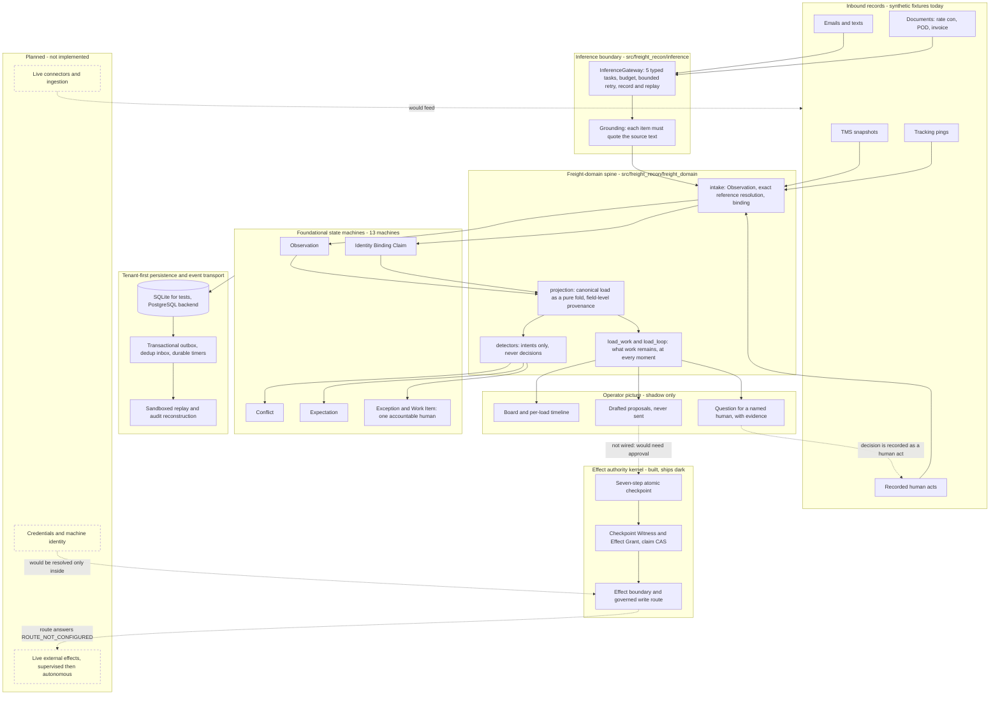
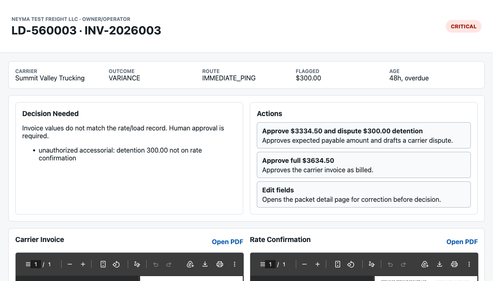

# Neyma

**An AI-native operating layer for freight brokerages: it reads fragmented freight records, keeps
one canonical picture of every load, notices what did *not* happen, and puts each open decision in
front of one accountable human — without ever letting a model's reading become authority.**

> **Status — engineering portfolio.** Active freight product development is paused following
> customer discovery. What is shown here is a working, heavily tested prototype that runs on
> **synthetic freight data in shadow mode**: no live external effect is enabled in this tree, and
> nothing in this repository is evidence of commercial adoption.
> The engineering is real; the scope is stated plainly in [Scope and limitations](#scope-and-limitations).

> ⚠️ **AI coding agents:** read [`CLAUDE.md`](CLAUDE.md) before anything else. It is the operating
> guide for this repository and outranks this file.

---

## What it does

A freight brokerage runs on email threads, driver texts, tracking pings, TMS rows, PDFs and phone
calls that routinely contradict each other. Most of what goes wrong is a **silence**: the POD that
never arrived, the check call nobody made, the appointment that moved and the truck that missed it.

Neyma's job is to own that mess for one load at a time:

- **Read** inbound records. Structured ones go straight in; free text goes through one narrow,
  typed model boundary whose output must quote the words it was read from.
- **Bind** each record to a canonical load by *exact* reference, per brokerage — or hold it for a
  human. It never guesses which load a document belongs to.
- **Keep a canonical record** where every field remembers who said it and how much that source can
  bear (`OWNER_ASSERTED`, `SYSTEM_IMPORTED`, `MODEL_EXTRACTED`, …).
- **Raise** a Conflict when sources disagree, an Expectation with a deadline when something is
  owed, and an Exception with one named owner when a human must decide.
- **Answer, at every moment:** what is happening and on what evidence, what work remains, what is
  overdue, what Neyma would do next, what needs a human and why, and whether the load is ready to
  bill.

The unit of value is a **closed operational loop**, not a processed document.

## Demonstration: a delivery the driver reported and the truck had not made

A driver texts *"delivered, empty"* before the receiver's window has opened. Five minutes later the
tracking provider shows the truck on the interstate. Neyma does not pick a winner — it raises a
Conflict and asks a named human. Dana calls the receiver and records that the load is still in
transit.

The hard part is what must be true *afterwards*. The driver's claim had already answered the
delivery appointment's watch, so overruling him has to make that watch **owed again** — otherwise
the load reads "quiet, nothing to do" while a truck misses its appointment.

```bash
.venv/bin/python docs/portfolio/demo/disputed_delivery.py
```

Actual output, excerpted: one line per moment, column spacing condensed and the trailing list of
open needs trimmed (`~` marks a deadline that passed with nothing arriving). The unedited capture
is [`docs/portfolio/demo/expected_output.txt`](docs/portfolio/demo/expected_output.txt).

```text
  09-02T12:30 driver-says-delivered   DELIVERED  NEYMA_CAN_ACT   bill=no  touch=0 NEYMA:REQUEST_POD
  09-02T12:35 provider-says-moving    DISPUTED   HUMAN_ATTENTION bill=no  touch=1 HUMAN:EVIDENCE_CONFLICT
  09-02T13:00 dana-says-moving        IN_TRANSIT WAIT            bill=no  touch=1 WAIT
 ~09-02T15:01 deadline@15:01          IN_TRANSIT NEYMA_CAN_ACT   bill=no  touch=1 NEYMA:REQUEST_CARRIER_STATUS
  09-02T18:30 at-delivery             IN_TRANSIT QUIET           bill=no  touch=1 NOTHING
  09-02T19:00 delivered               DELIVERED  NEYMA_CAN_ACT   bill=no  touch=1 NEYMA:REQUEST_POD
  09-02T19:30 pod                     DELIVERED  QUIET           bill=yes touch=1 NOTHING

WHAT THE CANONICAL RECORD HOLDS AT THE END
  delivery-arrival watches on this stop   ['DISCHARGED', 'DISCHARGED']
  claims a human overruled, still on file [('driver_assertion', 'DELIVERED')]
  tracking disputes                       [('RESOLVED_BY_HUMAN', 2)]
  quiet while the delivery was still owed []
  external-effect rows written            0
```

What to notice:

- **12:35** — two sources disagree, so the stage is `DISPUTED` and the question goes to
  `dana.ortiz` with both pieces of evidence attached. Nothing auto-resolves.
- **13:00** — her decision restores `IN_TRANSIT`, withdraws the premature POD request, and re-opens
  the delivery watch with the appointment's real deadline.
- **15:01** — the window closes in silence. That silence is itself the event: Neyma *would* ask
  the carrier for status. The message is a draft; **nothing is sent**.
- **End state** — nothing was rewritten. The driver's claim is still on file, marked overruled; the
  watch it answered is still discharged *by his record*; the owed watch is a second row.

Run against the commit before the fix, the same script prints `QUIET … NOTHING` at 13:00 and stays
silent through the missed appointment. That bug, its reproduction and the regression tests are the
subject of the [technical case study](docs/portfolio/CASE_STUDY.md).
Full walkthrough, expected output and a recording storyboard: [`docs/portfolio/DEMO.md`](docs/portfolio/DEMO.md).

More of the same engine, on the shipped synthetic corpus:

```bash
.venv/bin/python scripts/run_freight_corpus.py --loop                             # 21 loads, side by side
.venv/bin/python scripts/run_freight_corpus.py --loop --load LD-50015 --detail    # an appointment that moved
.venv/bin/python scripts/run_freight_corpus.py --loop --attack                    # hostile mutations of those loads
```

## Core technical capabilities

| Capability | What is actually built | Where |
|---|---|---|
| **Bounded LLM interpretation** | Five typed tasks and no general-purpose prompt call. Strict structured outputs, a per-run budget, bounded retry, record/replay, and a grounding pass that drops any item whose evidence quote is not literally in the source text. | [`src/freight_recon/inference/`](src/freight_recon/inference/), [`freight_domain/interpretation.py`](src/freight_recon/freight_domain/interpretation.py) |
| **Field-level provenance** | Every fact carries where it came from and what it may bear. A `MODEL_INFERRED` fact raises if a consequential gate tries to read it; an `OWNER_ASSERTED` fact is never machine-overwritten. | [`provenance.py`](src/freight_recon/provenance.py), [`evidence.py`](src/freight_recon/evidence.py), [`freight_domain/model.py`](src/freight_recon/freight_domain/model.py) |
| **Canonical state as a pure fold** | A load is a deterministic projection over durable Observations and binding decisions. Rebuilding the picture is re-running a function, which is what makes replay inert. | [`freight_domain/projection.py`](src/freight_recon/freight_domain/projection.py) |
| **Missing events are observable** | Expectations are durable commitments with deadlines. `OVERDUE` (we were watching and it never came) is a different fact from `INDETERMINATE` (the deadline passed while the channel was blind). | [`expectation.py`](src/freight_recon/expectation.py), [`event_timers.py`](src/freight_recon/event_timers.py), [`freight_domain/detectors.py`](src/freight_recon/freight_domain/detectors.py) |
| **Disagreement is a human's decision** | A Conflict is never resolved by recency, confidence, a model or a clock — only by a recorded human act. | [`conflict.py`](src/freight_recon/conflict.py) |
| **Tenant isolation in the schema** | Tenant is first in every key, required at construction, and sentinel values such as `default` are refused. Cross-tenant and absent are indistinguishable. | [`tenant.py`](src/freight_recon/tenant.py), [`persistence.py`](src/freight_recon/persistence.py) |
| **Effect authority kernel** | A seven-step atomic checkpoint, an unforgeable freshness witness, a one-time Effect Grant and an atomic claim compare-and-set — the "two-key rule" for acting on the outside world. Built and tested; **ships dark**. | [`checkpoint.py`](src/freight_recon/checkpoint.py), [`effect_boundary.py`](src/freight_recon/effect_boundary.py), [`commit_key.py`](src/freight_recon/commit_key.py) |
| **Durable event transport** | Transactional outbox, de-duplicating inbox, durable timers, sandboxed replay and audit reconstruction, on SQLite for tests with a PostgreSQL backend. | [`event_outbox.py`](src/freight_recon/event_outbox.py), [`event_inbox.py`](src/freight_recon/event_inbox.py), [`event_replay.py`](src/freight_recon/event_replay.py) |
| **Tests that can fail** | Mutation batteries that reintroduce each real defect and require a named test to go red; independent audit oracles run on every evaluation; negative assertions must prove their population first. | [`scripts/mutate_*.py`](scripts/), [`eval/tests/`](eval/tests/) |

## Architecture



Solid boxes exist in this tree and are exercised by the test suite. Dashed boxes are planned and
**not** implemented. The kernel is real code with its own tests, but no production path reaches it:
the governed route answers a recorded `ROUTE_NOT_CONFIGURED` refusal and the production policy
gate registry is empty.

A guided tour of each layer, with source references and what is and is not built:
[`docs/portfolio/ARCHITECTURE_TOUR.md`](docs/portfolio/ARCHITECTURE_TOUR.md).
The canonical design document is [`ARCHITECTURE.md`](ARCHITECTURE.md).

## Quick start

Requires Python 3.11 or newer. No API key, network access or external account is needed for
anything below — the demos and the default test run call no model and no outside system.

```bash
git clone https://github.com/sheed17/freight-operational-teammate.git
cd freight-operational-teammate

python3 scripts/check_env.py                 # fail-fast: enforces the Python floor in pyproject.toml
python3 -m venv .venv
.venv/bin/python scripts/check_env.py        # verify the venv's interpreter too, before installing
.venv/bin/pip install -e ".[dev]"

.venv/bin/python docs/portfolio/demo/disputed_delivery.py      # the demonstration above
.venv/bin/python scripts/run_freight_corpus.py --loop          # 21 synthetic loads, booked to billing-ready
.venv/bin/python scripts/run_freight_interpretation_eval.py --stage all   # replays recorded model readings, $0
```

If `check_env.py` fails, create the venv with a newer interpreter (for example
`python3.12 -m venv .venv`).

## Tests and verified evidence

Every figure below was reproduced on commit `8ee5bf6`; the exact commands, what each number
measures and its limits are in [`docs/portfolio/METRICS.md`](docs/portfolio/METRICS.md).

| Evidence | Result | Command |
|---|---|---|
| Test population | 4,373 tests collected | `.venv/bin/python -m pytest eval --collect-only -q` |
| Freight-domain suite | 282 passed | `.venv/bin/python -m pytest eval/tests/test_p9_*.py -q` |
| Continuous load loop | 21 loads, 425 records, 4,802 evaluations, 513 labeled checks, 0 failed, 0 audit findings | `scripts/run_freight_corpus.py --loop` |
| Hostile mutation of the inputs | 393 mutated histories, 8,153 audited evaluations, 0 findings | `scripts/run_freight_corpus.py --loop --attack` |
| Mutation testing of the code | 102 of 102 reintroduced defects caught by their named tests | `scripts/mutate_p9_load_work.py` |
| Model interpretation (replayed) | 24/24 labeled messages, 209/209 fields; 264/264 labeled outcomes from raw text | `scripts/run_freight_interpretation_eval.py --stage all` |
| External effects performed by any run | 0 rows | asserted by every run above |

```bash
.venv/bin/python -m pytest eval -q                               # the whole suite (slow: CI shards it)
.venv/bin/python -m pytest eval/tests/test_p9_load_loop.py -q    # the load loop and its regressions
```

CI ([`.github/workflows/ci.yml`](.github/workflows/ci.yml)) runs the suite from a fresh checkout on
Python 3.11 and 3.12, partitioned into shards that are proven disjoint and total.

## Scope and limitations

**Implemented and tested**

- The freight-domain spine, the model interpretation boundary, the operational work engine and the
  continuous load loop, running on synthetic histories across multiple brokerages in one database.
- Thirteen foundational state machines, the event transport, provenance and evidence, typed policy
  and rules, and the effect-authority kernel.
- An earlier runtime for carrier-invoice reconciliation, document extraction, Slack review and
  read-only browser access to a TMS. It was the first surface built and is marked for controlled
  replacement ([`LEGACY-DISPOSITION.md`](docs/implementation/LEGACY-DISPOSITION.md)).

**Prototype, unproven or absent**

- **No customer deployment.** Nothing here records use by a paying or pilot customer. Every load,
  company and message on the freight-domain spine is invented. No freight rule in the code has
  been validated with a design partner; open questions are tracked in
  [`OPEN-VALIDATION-ITEMS.md`](docs/product/OPEN-VALIDATION-ITEMS.md).
- **Shadow only.** Proposals are drafts nobody sends, and on the current architecture no live
  external effect is enabled.
- **The earlier runtime did touch real TMS web applications during development.** Its
  configuration records accounts labelled as trial, sandbox and design-partner accounts, read
  through a browser, and one write to such an account in June 2026. Those write paths were later deleted,
  made read-only or routed behind the governed boundary, which refuses.
- **No live ingestion.** There is no production connector to a mailbox, TMS or tracking provider
  on the new spine; records come from fixtures.
- **Model evidence is narrow.** The interpretation scores come from an in-house synthetic corpus
  read by one model, replayed from recordings. They show the pipeline works, not field accuracy.
- **The latest work is not independently reviewed.** The load loop and its three follow-up repairs
  are implemented and tested; the repository's own process still owes them a review by someone who
  did not write them, and the phase they belong to was never formally accepted.
- **No UI.** The operator picture is CLI output.
- **Deadlines are configuration.** Neyma watches only what a brokerage's setup says to watch; in
  the demo, a truck at the dock with no unload clock configured reads as quiet until the delivery
  report arrives.

<details>
<summary>Screenshot of the earlier review-packet surface (synthetic data)</summary>



</details>

## Technical case study

[`docs/portfolio/CASE_STUDY.md`](docs/portfolio/CASE_STUDY.md) covers why naive "LLM reads the
inbox and acts" automation is unsafe here, the major trade-offs, and one difficult bug in depth: a
terminal state in the Expectation machine meant that when a human overruled a false "delivered",
the delivery quietly stopped being watched. It walks through the reproduction, the fix that
rewrites no history, and the regressions and mutants that now protect it.

## Repository map

| Path | Contains |
|---|---|
| [`src/freight_recon/freight_domain/`](src/freight_recon/freight_domain/) | The freight-domain spine, work engine and load loop |
| [`src/freight_recon/inference/`](src/freight_recon/inference/) | The only path to a model |
| [`src/freight_recon/`](src/freight_recon/) | State machines, kernel, event transport, persistence, and the earlier runtime |
| [`eval/tests/`](eval/tests/) | The test suite, guards and probes |
| [`eval/freight_corpus/`](eval/freight_corpus/) | Synthetic freight histories and recorded model readings |
| [`scripts/`](scripts/) | Demo runners, mutation batteries, migrations. Some legacy scripts are effect-capable; see [`EFFECT-PATH-INVENTORY.yaml`](docs/implementation/EFFECT-PATH-INVENTORY.yaml) |
| [`docs/portfolio/`](docs/portfolio/) | This showcase: demo, architecture tour, case study, metrics |
| [`docs/architecture/`](docs/architecture/), [`docs/specifications/`](docs/specifications/) | ADRs, entity, event and state-machine specifications |
| [`docs/implementation/`](docs/implementation/) | The full engineering record: phase reviews, adjudications, debt |

**Engineering record.** The project was built as a phased program with written acceptance
contracts and independent reviews. That record is preserved unchanged:
[`docs/implementation/CURRENT.md`](docs/implementation/CURRENT.md) is the status authority,
[`PRODUCT.md`](PRODUCT.md) defines the product, [`ARCHITECTURE.md`](ARCHITECTURE.md) is the
canonical architecture, and [`docs/CANONICAL-DOCUMENTS.md`](docs/CANONICAL-DOCUMENTS.md) says which
documents carry authority. Files directly under `docs/` that predate the architectural reset are
historical evidence, not current description.

---

*The previous README was an internal status page for the phased program. It is preserved in git
history at `8ee5bf6`.*
