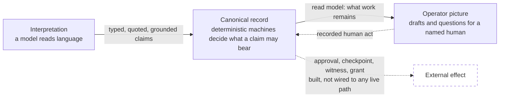
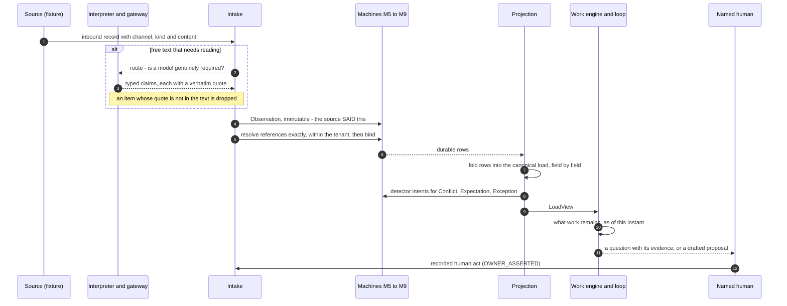
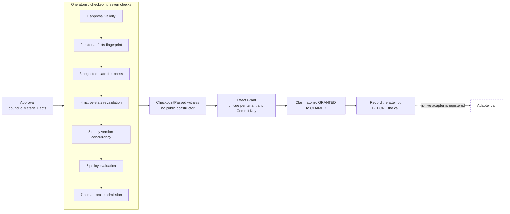

# Architecture tour

A guided reading of what is actually in this tree, layer by layer, with the source file for each
claim. The canonical design document is [`ARCHITECTURE.md`](../../ARCHITECTURE.md); this tour is a
map for a reader with ten minutes, and where the two differ the canonical document wins.

Everything described as **built** exists at commit `8ee5bf6` and is exercised by the test suite.
Everything described as **planned** is not implemented. All paths are relative to
[`src/freight_recon/`](../../src/freight_recon/).

## The one idea

The system is organised around a single refusal: **a model's reading of a message must never
become a fact, and a fact must never become an action, without passing through something
deterministic that a human can be held accountable for.**

That gives three layers with hard seams between them:



## End-to-end: one inbound record



---

## 1. Freight information intake and interpretation

**Built.** [`freight_domain/history.py`](../../src/freight_recon/freight_domain/history.py) defines
the input contract: one inbound record is a TMS snapshot, a tracking signal, an appointment
reading, a document, an email or text, or an authenticated act by the brokerage's own staff. A
record names the **channel** it arrived on and its **kind**; it is refused if it tries to state its
own provenance.

[`freight_domain/intake.py`](../../src/freight_recon/freight_domain/intake.py) processes one record
at a time:

```
record -> Observation -> parse -> resolve references -> bind -> project -> detect
       -> Conflict / Expectation / Exception
```

Two rules do most of the work:

- **Only the system of record creates a load.** No email, text, document or ping ever does; those
  must resolve to a load that exists, or they are held.
- **The binding is exact or it is a human's.**
  [`freight_domain/entity_mapping.py`](../../src/freight_recon/freight_domain/entity_mapping.py)
  matches the full `(tenant, external_system, external_id_kind, external_id)` tuple and returns
  `EXACT`, `AMBIGUOUS`, `RETIRED_ONLY` or unresolved. Every reference a record carries is resolved
  and the candidates are intersected; anything other than exactly one survivor goes to a person.

**Not built.** Live ingestion. There is no production connector feeding this spine from a mailbox,
a TMS or a tracking provider; records come from fixtures in
[`eval/freight_corpus/`](../../eval/freight_corpus/). (The earlier runtime has IMAP, Slack and
read-only browser adapters; they are not connected to this layer.)

## 2. The LLM inference boundary and structured outputs

**Built.** [`inference/`](../../src/freight_recon/inference/) is the only path from the new spine
to a model.

| Property | Mechanism | File |
|---|---|---|
| No general-purpose prompt call | Five tasks, each with a typed request and a strict typed output: `interpret_message`, `interpret_document_text`, `extract_commitments`, `propose_entity_candidates`, `reason_load_work` | `inference/contracts.py` |
| One execution path for live, replayed and scripted calls | Routing check, budget asked before every attempt, bounded retry, output validated against the task's model, one telemetry record per call | `inference/gateway.py` |
| Live calls are opt-in, structurally | The OpenAI client raises unless constructed with `allow_live=True`; the SDK is imported lazily and built with `max_retries=0` so every attempt is counted | `inference/openai_responses.py` |
| Tests never reach a network | A scripted gateway runs the same path; an unscripted call raises rather than passing silently | `inference/scripted.py` |
| Evals are paid for once | Readings are recorded under a SHA-256 of provider, model, task, schema version, prompt version, effort and input; change any and the recording no longer matches | `inference/recording.py` |
| Telemetry holds no content | Token counts and an input digest; never the message, prompt or key | `inference/ledger.py` |
| Prompt injection is data | Content is fenced and every instruction block says a message asserting "this is approved" is text to report on | `inference/prompts.py` |

What the application then does with a reading is in
[`freight_domain/interpretation.py`](../../src/freight_recon/freight_domain/interpretation.py):

```
route      is language interpretation genuinely required? usually it is not
read       one typed model reading through the gateway
ground     every item's evidence quote must really be in the content, or the item is dropped
normalize  deterministic arithmetic: a deadline, a calendar date, integer minor units
```

A promise ("I'll update you in an hour") becomes an Expectation whose deadline the *application*
computes. A quoted promise does not. A claimed approval is treated as a reason to look harder and
is never an authorization. A model-proposed load is a candidate for a human and never a binding.

The fifth task, `reason_load_work`
([`freight_domain/work_reasoning.py`](../../src/freight_recon/freight_domain/work_reasoning.py)),
is asked only when the deterministic record leaves act-or-wait genuinely open. It may choose among
actions it was handed; any id it names that it was not handed is refused; a failure leaves the
deterministic work exactly as it was.

**Limits.** One provider is implemented (OpenAI Responses API). No production code path calls a
model through this boundary; the only caller that passes `allow_live` is the evaluation script.

## 3. Evidence and canonical operational state

**Built.**

- **Observation** ([`observation.py`](../../src/freight_recon/observation.py)): an immutable record
  that a source *said* something at a time. It is not a claim that the thing is true.
- **Identity Binding Claim**
  ([`identity_binding_claim.py`](../../src/freight_recon/identity_binding_claim.py)): which
  canonical entity a record belongs to is itself a claim with a lifecycle, and a human can correct
  it.
- **Evidence** ([`evidence.py`](../../src/freight_recon/evidence.py)): content-addressed, immutable
  artifacts and the spans that make an extracted claim checkable. It fails closed when an artifact
  is lost.
- **Provenance** ([`provenance.py`](../../src/freight_recon/provenance.py)): six classes —
  `SYSTEM_IMPORTED`, `OWNER_ASSERTED`, `LINKER_INFERRED`, `MODEL_EXTRACTED`, `MODEL_INFERRED`,
  `RECONCILED` — assigned by the runtime from how a record was acquired, never by the record. A
  `MODEL_INFERRED` fact raises `GateReadOfInferredFact` if a consequential gate reads it.
- **The canonical model**
  ([`freight_domain/model.py`](../../src/freight_recon/freight_domain/model.py)): authority is
  field-level. A `Field` is the append-only history of what each source said about one attribute,
  and it reports one of five evidence conditions rather than flattening a disagreement into a value.
- **The projection**
  ([`freight_domain/projection.py`](../../src/freight_recon/freight_domain/projection.py)): the
  canonical load is a pure, deterministic fold over the durable rows for one tenant. It writes
  nothing and calls no machine.

**Trade-off.** There are no per-entity freight tables. The load is recomputed from observations on
every read. That buys replay-by-construction and an honest history, and costs read performance,
which was never measured at volume.

## 4. Events, expectations, deadlines and conflicts

**Built.**

- **Expectation** ([`expectation.py`](../../src/freight_recon/expectation.py)): a durable
  commitment that something should be observed by a deadline. `OVERDUE` means it never came and we
  can prove we were watching; `INDETERMINATE` means the deadline passed while the channel was
  blind. They are different facts and are handled differently.
- **Conflict** ([`conflict.py`](../../src/freight_recon/conflict.py)): two or more mutually
  exclusive claims on one field. Not resolvable by recency, confidence, a model or a clock.
- **Exception** ([`exception.py`](../../src/freight_recon/exception.py)): one row per thing that
  needs a human, with one named owner.
- **Detectors**
  ([`freight_domain/detectors.py`](../../src/freight_recon/freight_domain/detectors.py)): pure
  functions over a load's projection that return *intents*. The machines decide whether each is
  new, a coalescing duplicate or illegal. Every threshold comes from the brokerage's configuration
  or is absent.
- **Time passing is an event**
  ([`freight_domain/load_loop.py`](../../src/freight_recon/freight_domain/load_loop.py)): the loop
  re-evaluates at every deadline the canonical record holds, so a window that closes in silence is
  a moment of its own.
- **Event transport**: 118 canonical event contracts
  ([`event_contracts.py`](../../src/freight_recon/event_contracts.py)); a transactional outbox so a
  state change and its event commit together or not at all
  ([`event_outbox.py`](../../src/freight_recon/event_outbox.py)); a de-duplicating inbox that
  processes an event and records it in one transaction
  ([`event_inbox.py`](../../src/freight_recon/event_inbox.py)); durable timers instead of
  background sweeps ([`event_timers.py`](../../src/freight_recon/event_timers.py)).

Events are facts. No consumer may treat one as permission.

## 5. Human authority and approval boundaries

**Built.**

- **One accountable owner.** A Work Item has exactly one accountable human at all times
  ([`work_item.py`](../../src/freight_recon/work_item.py)); every Exception names one.
- **Human acts are a distinct input kind.** `confirm_movement_status`, `confirm_appointment` and
  `correct_binding` arrive as authenticated assertions and enter the record as `OWNER_ASSERTED`.
  An act in the name of someone the brokerage has not recorded settles nothing and is itself
  raised to a human. An act dated later than it was received is refused.
- **A tracking record cannot speak as the owner.** A record naming itself an owner confirmation is
  unparseable.
- **Approval** ([`approval.py`](../../src/freight_recon/approval.py)): binds a human's consent to
  exact Material Facts and an authority, expires, and is revocable. Drift in the facts voids it.
- **Policy** ([`policy.py`](../../src/freight_recon/policy.py),
  [`policy_admission.py`](../../src/freight_recon/policy_admission.py)): typed and compiled, never
  a prompt string. A tenant may narrow what is permitted and may never broaden it.
- **Proposal boundary** ([`proposal.py`](../../src/freight_recon/proposal.py)): natural-language
  interpretation is an input; it becomes an inert structured proposal and nothing more.
- **Brake** ([`brake.py`](../../src/freight_recon/brake.py)): human admission control over whether
  new work may start.

**Not built.** Any operator-facing surface where a person actually answers these questions. In the
load loop a human act is a fixture record.

## 6. Tenant isolation

**Built.**

- [`tenant.py`](../../src/freight_recon/tenant.py) refuses empty, blank and sentinel tenants.
  `"default"` is not a tenant; it is the absence of one, spelled in a way that compiles.
- Tenant is first in every key and is enforced by the database through composite keys and
  tenant-aware foreign keys
  ([`migrations/phase2_tenant_first.py`](../../src/freight_recon/migrations/phase2_tenant_first.py)).
- Stores require a tenant at construction; a guard discovers every construction site in the
  repository and fails on one without it
  ([`eval/tests/test_ac_sec_001_registry.py`](../../eval/tests/test_ac_sec_001_registry.py)).
- The freight corpus runs several brokerages through **one database** on purpose. Two of them hold
  the same load number, PO, BOL, PRO and invoice number; one brokerage's POD must satisfy nothing
  at the other. Every run reports `wrong_cross_tenant_mappings`, and it must be zero.

**Limit.** Isolation is proven at the persistence and mapping boundaries, in tests, on SQLite. It
has not been tested in a deployed multi-tenant service, because there is none.

## 7. Replay and restart behaviour

**Built.**

- [`event_replay.py`](../../src/freight_recon/event_replay.py) reconstructs state from canonical
  events in a sandbox. It cannot cause an effect — not by discipline, but because it cannot
  construct the witness an effect requires (section 8).
- Because the freight projection is a pure fold, rebuilding the freight picture is re-running a
  function. Work has no row of its own: a need's identity is derived from its cause, so asking
  twice creates nothing.
- The loop tests and the hostile mutation layer replay histories, deliver every record twice,
  reorder records, drop records, and restart in the middle, then require the same pictures and no
  lost or invented work
  ([`eval/tests/test_p9_load_loop.py`](../../eval/tests/test_p9_load_loop.py),
  [`eval/freight_corpus/work_attack.py`](../../eval/freight_corpus/work_attack.py)).
- [`event_audit.py`](../../src/freight_recon/event_audit.py) reconstructs how a state was reached
  using the beliefs of that day rather than current state.

## 8. External-effect containment

**Built, and dark.** This is the oldest and most heavily reviewed part of the system.



- **Commit Key vs Material Facts** ([`commit_key.py`](../../src/freight_recon/commit_key.py)). The
  Commit Key is the identity of the *effect*; the amount is deliberately not in it. Material Facts
  are the *content* of the decision. Merging them once let two approvals at different amounts
  become two effects on one invoice.
- **The witness cannot be forged** ([`checkpoint.py`](../../src/freight_recon/checkpoint.py)).
  `CheckpointPassed` has no public constructor, cannot be subclassed, pickled or copied, and is
  checked against a registry of genuine instances. Only the checkpoint's own success path creates
  one.
- **The two-key rule.** A grant alone is refused; a witness alone is refused.
- **One containment layer** ([`effect_boundary.py`](../../src/freight_recon/effect_boundary.py),
  [`governed_write_route.py`](../../src/freight_recon/governed_write_route.py)). The attempt is
  recorded before the call. A timeout is never recorded as a failure; it becomes
  `UNKNOWN_OUTCOME`, which never auto-resolves.
- **An import gate in CI** asserts that no module reaches an effect-capable adapter except through
  that boundary ([`eval/tests/test_import_gate.py`](../../eval/tests/test_import_gate.py)).

**What "dark" means precisely.** The deployed governed route answers a recorded
`ROUTE_NOT_CONFIGURED` refusal; the production policy gate registry is empty; no grant is minted
on any production path. The freight-domain package cannot reach an adapter at all, which a guard
proves structurally
([`eval/tests/test_p9_freight_domain_ships_dark.py`](../../eval/tests/test_p9_freight_domain_ships_dark.py)),
and every corpus run asserts that the effect ledger holds zero rows.

**Open finding, recorded by the project itself.** `RR-01`: an adapter's `base_url` is outside the
payload hash and outside the approval mismatch check. It is a stated precondition for ever
injecting a live writer and is not fixed.

## 9. Testing and evaluation

**Built.**

| Technique | What it is | Where |
|---|---|---|
| Labeled histories | Synthetic loads whose expected state is asserted at named checkpoints; only what a checkpoint labels is checked, and each mismatch is listed | `eval/freight_corpus/*.py` |
| Independent audit oracles | A second implementation of "is this load falsely quiet?", written without the detectors, run on **every** evaluation of every load | `eval/freight_corpus/work_attack.py` |
| Hostile mutation of inputs | Deterministic mutants of each history: late arrival, never arrives, duplicate delivery, reordering, restart, the same load at another brokerage | `scripts/run_freight_corpus.py --attack` |
| Mutation of the code | Each mutant reintroduces one real defect and names the test that must turn red; restore is in-memory and byte-verified | `scripts/mutate_*.py` (34 batteries) |
| Structural guards | AST and import-graph tests: no second effect authority, no literal tenant, no adapter import outside the boundary | `eval/tests/` |
| Anti-vacuity | A negative assertion must first prove its population is non-empty | throughout |
| Model evaluation | Field-by-field scoring of typed readings against labels, replayed from recordings | `scripts/run_freight_interpretation_eval.py` |
| CI | Fresh checkout, Python 3.11 and 3.12, shards proven disjoint and total | `.github/workflows/ci.yml` |

Figures and their limits: [`METRICS.md`](METRICS.md).

---

## Implemented versus planned, in one table

| Area | State |
|---|---|
| Effect identity, tenant-first persistence, checkpoint kernel, adapter containment | Built, reviewed and accepted under the project's process (see note), ships dark |
| Canonical events, outbox, inbox, replay, timers, PostgreSQL backend | Built, reviewed and accepted, no production caller |
| Thirteen state machines, provenance and evidence, policy, rules, brake | Built, reviewed and accepted |
| Freight-domain spine, model interpretation, work engine, load loop | Built and tested; **not formally accepted**; the latest repairs have not had their separate review |
| Earlier invoice-reconciliation runtime (extraction, Slack review, read-only TMS access) | Built; marked for controlled replacement |
| Live ingestion and connectors on the new spine | Planned, not built |
| Credentials and machine identity | Specified (ADR-014), not built |
| Any live external effect, supervised or autonomous | Not enabled in this tree. The earlier runtime's write paths were deleted, made read-only or routed behind the governed boundary |
| Operator UI | Not built |
| Validation with a real brokerage | Not done |

**What "reviewed" means here.** Each accepted phase was scored by a separate session that built
none of it and re-derived the evidence from the tree. Those were fresh AI-agent sessions directed
by the founder on one machine, not third-party human auditors, and the project's own records say
so. It is a real discipline — several reviews rejected the work they examined — and it is not an
external audit.

The phased program behind this table, with its acceptance contracts and reviews, is recorded in
[`docs/implementation/CURRENT.md`](../implementation/CURRENT.md) and
[`PHASE-OUTPUTS.md`](../implementation/PHASE-OUTPUTS.md).
